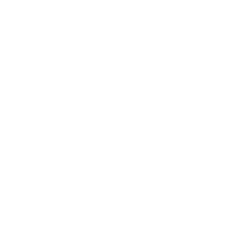
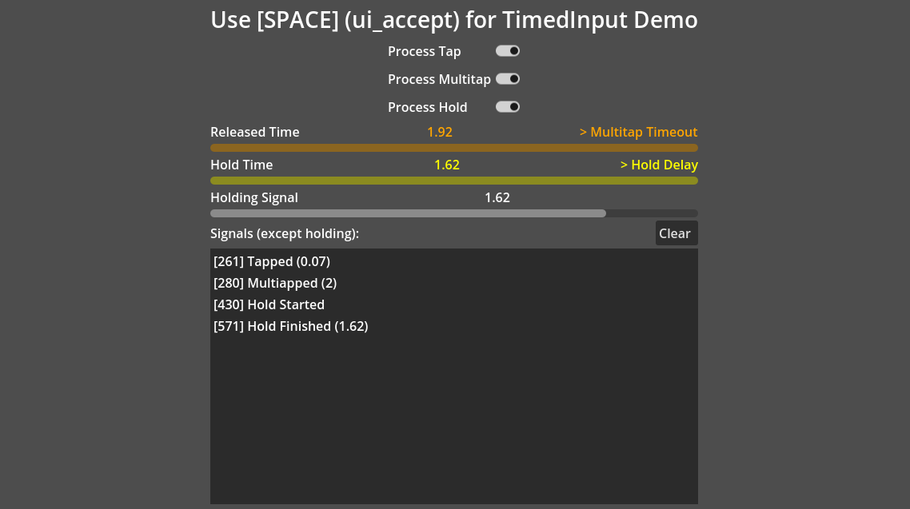

# TimedInput for Godot



Adds a node type that monitors an input action for long holds, short taps and multiple taps. Can emit signals or send InputEventActions. Which events are monitored and what is done in response are configurable.

The included demo covers much of the functionality of the addon. Try out the demo at https://hatmix.itch.io/godot-timed-input 



## TimedInput types

<dl>
<dt>Tap</dt>
<dd>An action input pressed and released before too long (see Action Hold Delay).</dd>
<dt>Multitap</dt>
<dd>One or more taps quickly following an initial tap (see Action Multitap Timeout).</dd>
<dt>Hold</dt>
<dd>An action input continuously pressed for at least a minimum time.</dd>
</dl>

## Configuration options

<dl>
<dt>Action</dt>
<dd>Name of an action from the input map to be timed</dd>
<dt>Action Hold Delay</dt>
<dd>How many seconds an action button/key must be held before it is a "hold" instead of a "tap"</dd>
<dt>Action Multitap Timeout</dt>
<dd>How many seconds after a tap can the next tap be part of a consecutive chain (multitap)</dd>
<dt>Emit Signals</dt>
<dd>Enable to emit signals for TimedInput types</dd>
<dt>Send Events</dt>
<dd>Enable to send events for TimedInput types</dd>
<dt>Process Tap, Process Multitap, Process Hold</dt>
<dd>Enable or disable each to react to or ignore the related TimedInput type</dd>
<dt>Emit Holding Signal</dt>
<dd>Enable to emit the holding signal with current total time held each physics frame, e.g. for easy progress bar updates.</dd>
<dt>Strength Scale</dt>
<dd>InputEventAction strength is used for the count of multitaps and duration of holds. Strength has a range of 0.0 to 1.0, so count and duration are multiplied by this scale value to get a valid strength. This is only needed in events as signals pass the actual values.</dd>
</dl>

## Signals

```
tapped (duration: float)
multitapped (count: int)
hold_started
holding (current_duration: float)
hold_finished(total_duration: float)
```

## Events

When enabled, input actions will be added based on the action being monitored.
```
[action name]_tap
[action name]_multitap
[action name]_hold_started
[action name]_hold_finished
```
Note that events are experimental and more likely to receive breaking changes.

## Motivation 

This addon grew out of coding my entry for the [1-Button Jam](https://itch.io/jam/1-button-jam-2023), [OBMG (One Button Mini-Golf)](https://hatmix.itch.io/OBMG).

## Attribution
* [imjp94/gd-plug](https://github.com/imjp94/gd-plug) used for plugin management
* [bitwes/GUT](https://github.com/bitwes/Gut) used for testing
* Stopwatch icon made by Lorc. Available at [game-icons.net](https://game-icons.net/1x1/lorc/stopwatch.html).
